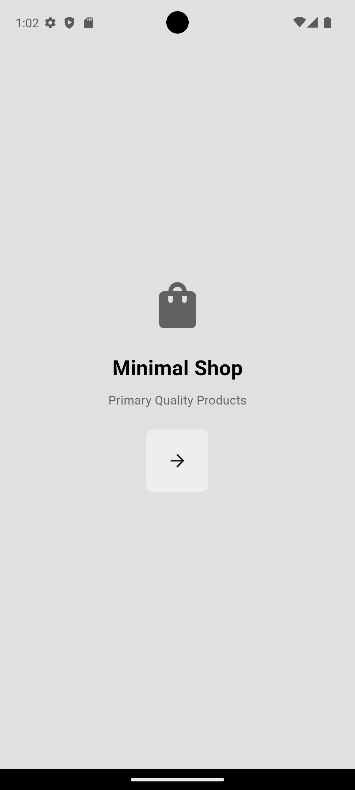
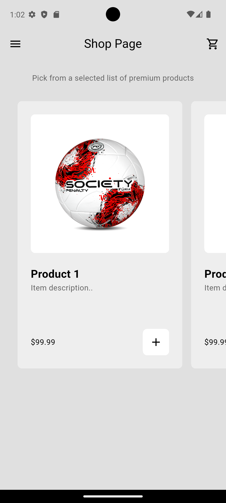

# 🛍️ Minimalist Shop App

A **minimalist** and **beautiful** Flutter application for exploring and purchasing products.  
Built with **intuitive navigation**, **efficient state management**, and a **modern, clean UI**.

## 📱 Screenshots

<p float="left">
  
  
</p>

## 🛠 Features

- 📂 **Navigation** for quick menu access
- 🛒 **Catalog** with detailed product tiles
- ➕➖ **Add & Remove** items from the cart
- 🔄 **Provider-based State Management** for app-wide updates

## 📂 Project Structure

```
lib/
├── main.dart              # App entry point
├── components/            # Reusable widgets
│   ├── my_button.dart
│   ├── my_drawer.dart
│   ├── my_product.dart
│   └── my_tile.dart
├── pages/                 # App screens
│   ├── cart_page.dart
│   ├── intro_page.dart
│   └── shop_page.dart
├── models/                # Data models
│   ├── product.dart
│   └── shop.dart
```
