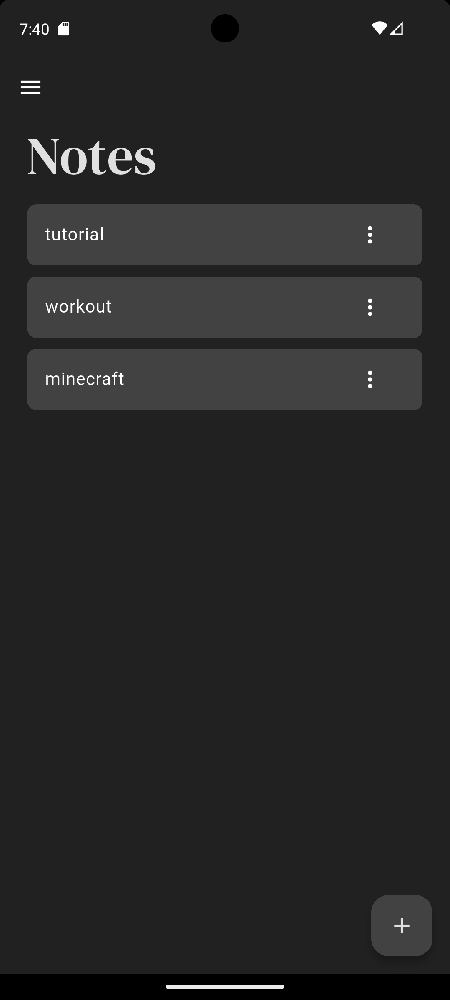

# 📝 Notes App

A lightweight and intuitive **note-taking app** built with Flutter.
Easily create, edit, delete, and organize your notes with a clean UI.

## 📱 Screenshots

<p float="left">
  
</p>

## 🛠 Features

- ➕ Create notes quickly
- 🖊️ Edit existing notes
- ❌ Delete notes with one tap
- 📂 Organize notes in a simple list view
- 💾 Local database using Isar
- 🌙/☀️ Dark & Light mode support

## 📂 Project Structure

```
lib/
├── components/            # Reusable widgets
│   ├── drawer_tile.dart
│   ├── drawer.dart
│   ├── note_settings.dart
│   └── note_tile.dart
├── pages/                 # App screens
│   ├── notes_page.dart
│   └── settings_page.dart
├── models/                # Data models
│   ├── product.dart
│   └── shop.dart
├── models/                # Themes models
│   ├── product.dart
│   └── shop.dart
├── main.dart              # App entry point
```
