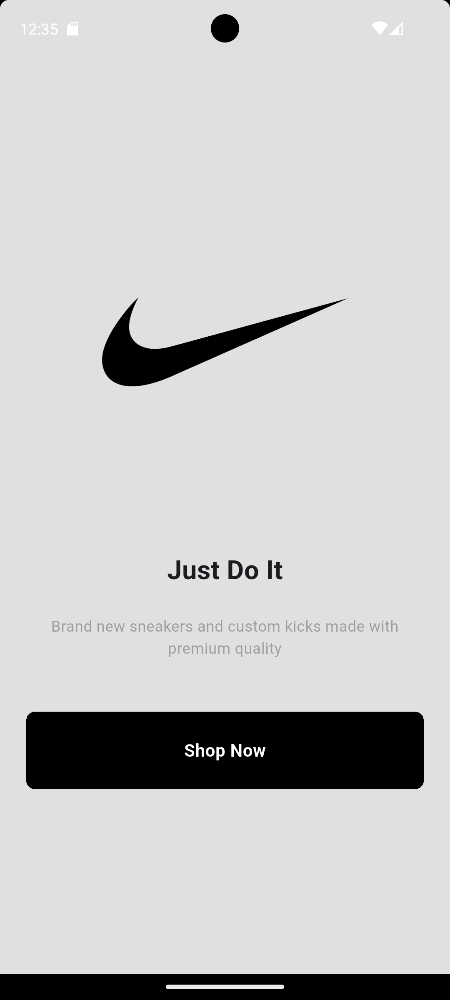
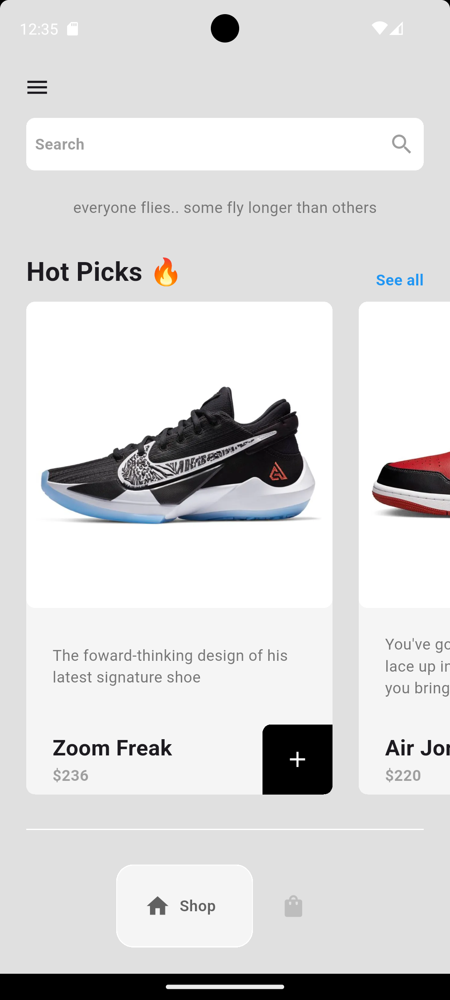

# 👟 Flutter Sneaker Shop App

A **simple** and **beautiful** Flutter application for browsing and buying sneakers.\
Built with **clean navigation**, **state management**, and an intuitive UI.

## 📱 Screenshots

<p float="left">
  
  
</p>

## 🛠 Features

- 📂 **Drawer Navigation** for quick menu access
- 📌 **Bottom Navigation Bar** for main sections
- 🛒 **Sneaker Catalog** with detailed product tiles
- ➕➖ **Add & Remove** items from the cart
- 🔄 **Provider-based State Management** for app-wide updates

## 📂 Project Structure

```
lib/
├── main.dart              # App entry point
├── components/            # Reusable widgets
│   ├── bottom_nav_bar.dart
│   ├── cart_item.dart
│   └── shoe_tile.dart
├── pages/                 # App screens
│   ├── cart_page.dart
│   ├── home_page.dart
│   ├── intro_page.dart
│   └── shop_page.dart
├── models/                # Data models
│   ├── shoe.dart
│   └── cart.dart
```
