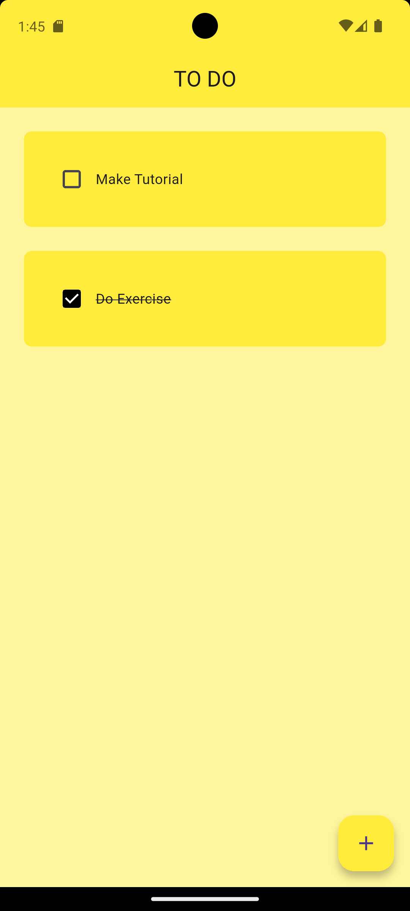

# ☑️ Flutter ToDo App

A **simple**, **beautiful**, and **lightweight** Flutter app to track your daily tasks — powered by local storage.

## 📱 Screenshots

<p float="left">
  
</p>

## 🛠 Features

- ➕ **Add** new tasks
- 🗑 **Delete** tasks
- ✅ **Mark as complete**
- 💾 **Offline storage** using Hive

## 📂 Project Structure

```
lib/
├── main.dart              # App entry point
├── utils/
│   ├── dialog_box.dart    # Modal for adding new tasks
│   ├── my_button.dart     # Custom action button
│   └── todo_tile.dart     # Task display tile
├── pages/
│   └── home_page.dart     # Main screen
├── data/
│   └── database.dart      # Local Hive database handler
```
